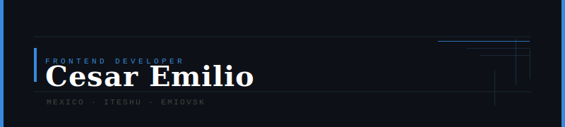

<div align="center">



</div>

---

```yaml
nombre:      Cesar Emilio Lopez Rodriguez
rol:         Frontend Developer
ubicacion:   Mexico
enfoque:     [ "Interfaces limpias", "Codigo ordenado", "Experiencia de usuario" ]
aprendiendo: [ "React", "TypeScript", "Accesibilidad web" ]
contacto:    emiovs2509@icloud.com
```

---

### Tecnologias

<div align="center">


</div>

---

<div align="center">
<sub>Cesar Emilio Lopez Rodriguez · Frontend Developer · Mexico</sub>
</div>
